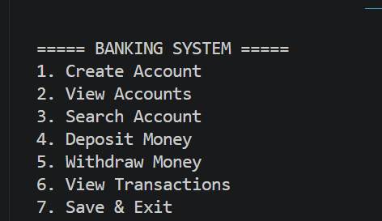
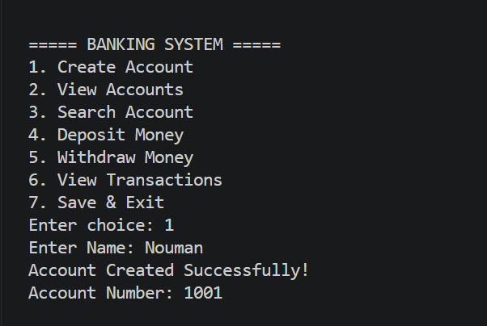
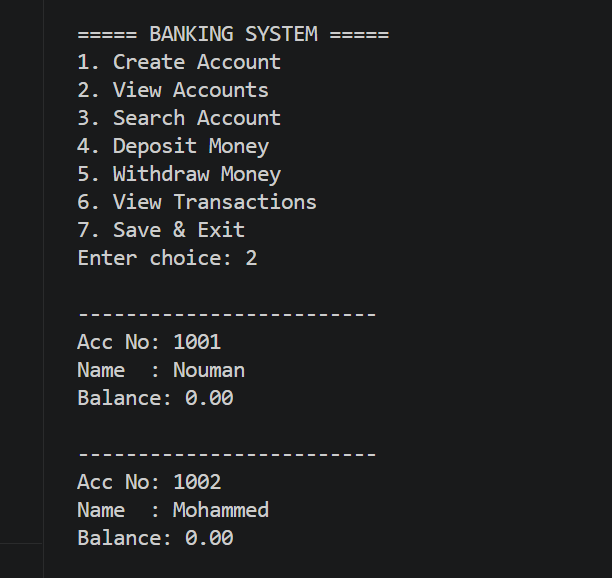
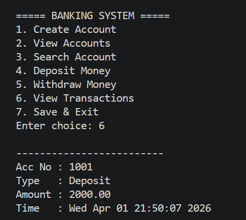

# 🏦 Banking System in C (CLI-Based)

## 📌 Overview
This project is a **Command-Line Banking Management System** developed using the C programming language. It simulates core banking operations such as account management and transaction processing with persistent storage.

The system is designed to demonstrate **system-level programming concepts**, including structured data handling, file management, and modular design.

---

## 🚀 Features

### 🔹 Account Management
- Create new bank accounts  
- View all accounts  
- Search account by account number  

### 🔹 Transactions
- Deposit money  
- Withdraw money with balance validation  
- Prevent overdraft  

### 🔹 Transaction History
- Records every transaction (Deposit/Withdraw)  
- Stores timestamp for each transaction  

### 🔹 Data Persistence
- Saves account and transaction data using file handling  
- Automatically loads data on program start  

---

## 🧠 Concepts Used

- Structures (`struct`)  
- File Handling (`fopen`, `fread`, `fwrite`)  
- Arrays and Data Management  
- String Handling (`strcpy`, `strcmp`)  
- Time Handling (`time.h`)  
- Modular Programming  

---

## 🖥️ Tech Stack

- Language: C  
- Interface: Command Line Interface (CLI)  

---

## 📂 Project Structure

BankingSystem/
┣ main.c
┣ accounts.dat
┣ transactions.dat
┗ README.md

---

## ▶️ How to Run

1. Compile the program: gcc main.c -o banking

2. Run the executable: ./banking

---

## 📸 Screenshots

### 🔹 Main Menu
Displays all available banking operations.

---

### 🔹 Create Account
Allows users to create a new account with a unique account number.

---

### 🔹 View Accounts
Displays all account details including balance.

---

### 🔹 Transactions
Shows deposit and withdrawal operations with timestamps.

---

## 🎯 Learning Outcome

This project helped in understanding how low-level programming can be used to build real-world systems involving structured data, transaction handling, and persistent storage.

---

## 🔗 Future Improvements

- Sorting accounts by balance  
- Display last N transactions  
- Enhanced input validation  
- Multi-user support  
- GUI-based version  

---

## 👨‍💻 Author

Mohammed Nouman